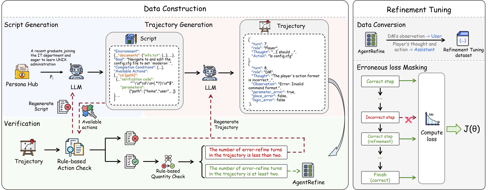

 # <div align="center">   AgentRefine: Enhancing Agent Generalization through Refinement Tuning<div>


<div align="center">
<a></a>
  <a href="https://arxiv.org/pdf/2501.01702" target="_blank"></a>
</div>

## 💥 News
- [01/2025] 🔥 Our paper has been accepted by **ICLR 2025**. 

- [01/2025] 🔥 We will release our model, inference code in one month! 


---



---


## 💡Introduction
Large Language Model (LLM) based agents have proved their ability to perform complex tasks like humans. However, there is still a large gap between open-sourced LLMs and commercial models like the GPT series. In this paper, we focus on improving the agent generalization capabilities of LLMs via instruction tuning. We first observe that the existing agent training corpus exhibits satisfactory results on held-in evaluation sets but fails to generalize to held-out sets. These agent-tuning works face severe formatting errors and are frequently stuck in the same mistake for a long while. We analyze that the poor generalization ability comes from overfitting to several manual agent environments and a lack of adaptation to new situations. They struggle with the wrong action steps and can not learn from the experience but just memorize existing observation-action relations. Inspired by the insight, we propose a novel **AgentRefine** framework for agent-tuning. The core idea is to enable the model to learn to correct its mistakes via observation in the trajectory. Specifically, we propose an agent synthesis framework to encompass a diverse array of environments and tasks and prompt a strong LLM to refine its error action according to the environment feedback. **AgentRefine** significantly outperforms state-of-the-art agent-tuning work in terms of generalization ability on diverse agent tasks. It also has better robustness facing perturbation and can generate diversified thought in inference. Our findings establish the correlation between agent generalization and self-refinement and provide a new paradigm for future research.


## ✈️ Training Data

We provided our training data in HuggingFace

[AgentRefine-gpt4o-32000](https://huggingface.co/datasets/fudayuan/AgentRefine-gpt4o-32000) 

[AgentRefine-gpt4o-64000](https://huggingface.co/datasets/fudayuan/AgentRefine-gpt4o-64000) 

[AgentRefine-deepseek-4000](https://huggingface.co/datasets/fudayuan/AgentRefine-deepseek-4000)

⭐ **We will also provide inference code and model soon! Thanks for waiting!**

## Citation
Please kindly cite our paper if it helps your research:
```bibtex
@inproceedings{
fu2025agentrefine,
title={AgentRefine: Enhancing Agent Generalization through Refinement Tuning},
author={Dayuan Fu and Keqing He and Yejie Wang and Wentao Hong and Zhuoma GongQue and Weihao Zeng and Wei Wang and Jingang Wang and Xunliang Cai and Weiran Xu},
booktitle={The Thirteenth International Conference on Learning Representations},
year={2025},
url={https://openreview.net/forum?id=FDimWzmcWn}
}
```
